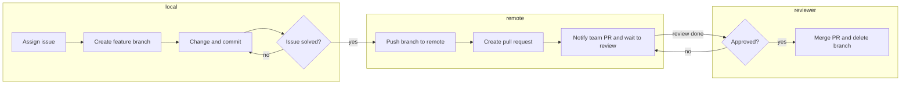

# Pull Requests Workflow

```mermaid
flowchart LR
  subgraph local
  A[Assign issue] --> B[Create feature branch]
  B --> C[Change and commit]  
  C --> D{Issue solved?} -- no --> C  
  end
  subgraph remote
  D -- yes --> E[Push branch to remote]
  E --> F[Create pull request]
  F --> G[Notify team PR and wait to review] 
  end
  subgraph reviewer
  G -- review done --> H{Approved?}
  H -- yes --> I[Merge PR and delete branch]
  H -- no --> G
  end
```

# Who Reviewer ?
- owner 
- 1 or 2 peoples
- sr
- team lead