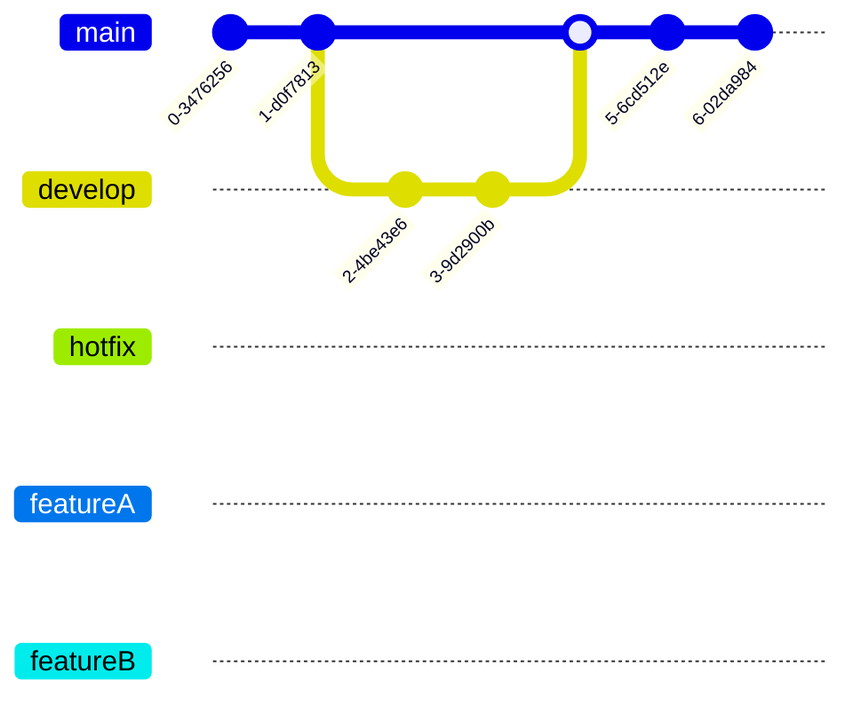

# Git flow Diagrams Streaming Dev Team

```mermaid {scale: 0.5}
%%{init: { 'logLevel': 'debug', 'theme': 'default' } }%%
      gitGraph
        commit
        commit
        branch develop
        checkout develop
        commit
        commit
        checkout main
        merge develop
        commit
        commit
        branch hotfix
        branch featureA
        branch featureB

```

