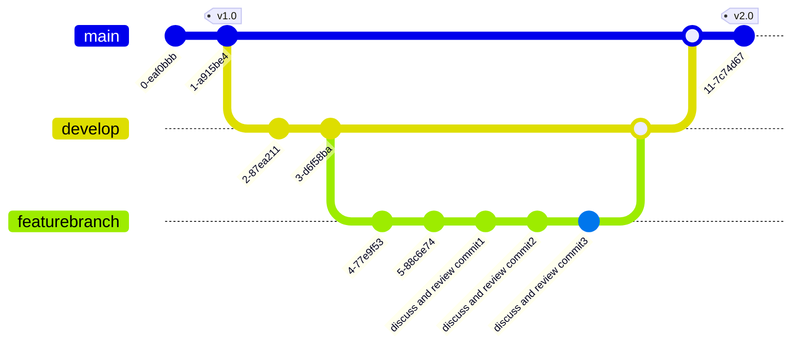

### Git flow Diagrams Streaming Dev Team (1-3 peoples)

```mermaid {scale: 0.1}
%%{init: { 'logLevel': 'debug', 'theme': 'default' } }%%
      gitGraph
        commit
        commit tag: "v1.0"
        branch develop
        checkout develop
        commit
        commit
        branch featurebranch
        checkout featurebranch
        commit
        commit
        commit id: "discuss and review commit1"
        commit id: "discuss and review commit2"
        commit id: "discuss and review commit3"
        checkout develop
        merge featurebranch
        checkout main
        merge develop
        commit tag: "v2.0"

```

