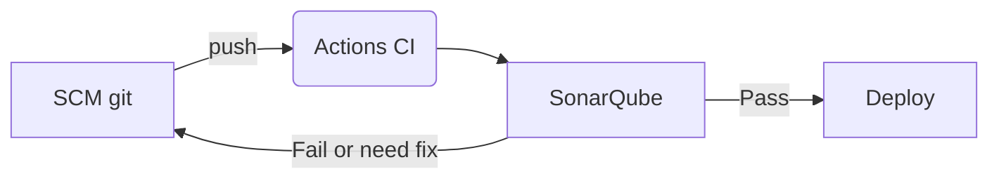

---

# Diagrams

CI Diagrams

```mermaid {theme: 'neutral', scale: 0.8}
flowchart LR
    A[SCM git] -->|push| B(Actions CI)
    B --> C[SonarQube]
    C --> |Pass| D[Deploy]
    C --> |Fail or need fix| A
```

